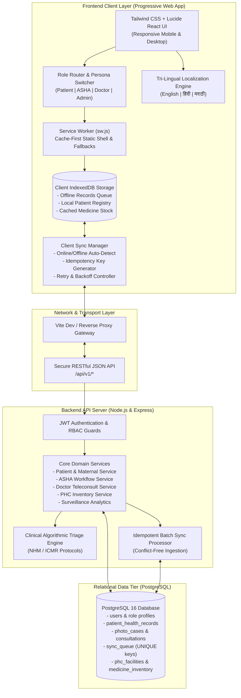
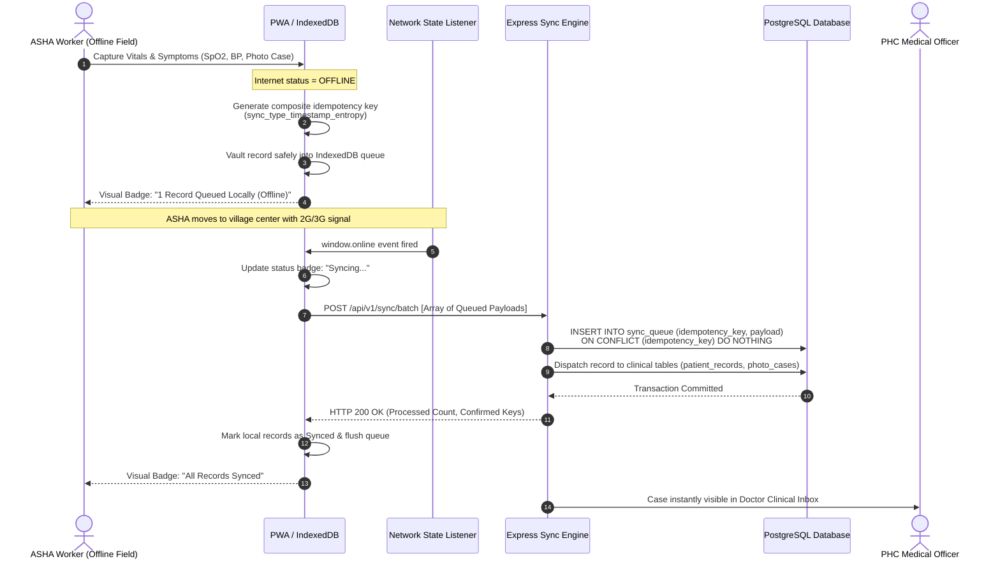
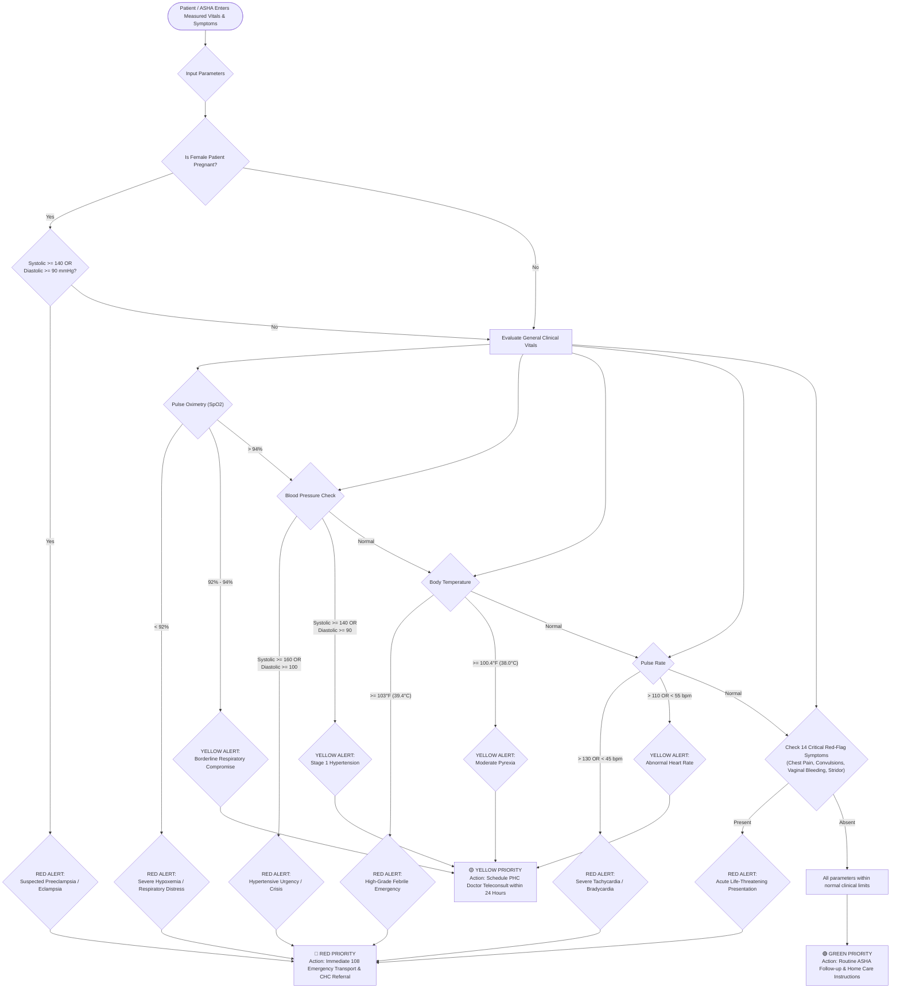
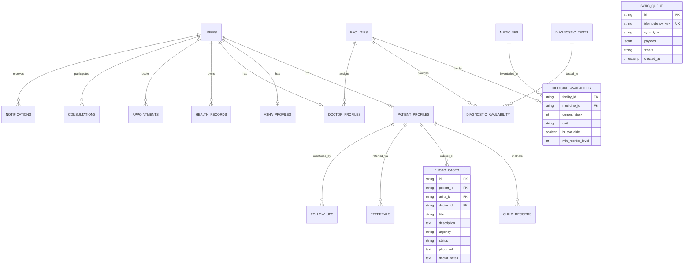

# AarogyaSync (आरोग्यसिंक)
> **Resilient Offline-First Rural Healthcare Platform & Telemedicine Ecosystem**  
> *Designed for Smart India Hackathon (SIH) — Problem Statement 133: Transforming Last-Mile Primary Healthcare Delivery*

[](https://sih.gov.in)
[](https://developer.mozilla.org/en-US/docs/Web/Progressive_web_apps)
[](frontend/src/translations/)
[](frontend/)
[](backend/)
[](backend/src/db/)
[](backend/test_api.js)
[](LICENSE)

---

## 📌 Executive Summary & Problem Context

In India's remote rural hamlets and tribal belts, primary health delivery faces three critical systemic bottlenecks:
1. **Network Blackouts:** Over 65% of rural sub-centres experience intermittent or zero cellular connectivity, causing digital health tools to crash or lose patient records.
2. **Medical Officer Scarcity:** A single doctor at a Primary Health Centre (PHC) often serves 25,000–30,000 citizens across 20+ scattered villages.
3. **Linguistic & Literacy Divide:** Rural patients and frontline Accredited Social Health Activists (ASHA workers) struggle with English-centric applications, resulting in underreported maternal high-risk signs and delayed emergency interventions.

**AarogyaSync** solves these challenges by combining a **zero-data-loss offline progressive web application**, **localized tri-lingual interfaces (English, हिंदी, मराठी)**, **National Health Mission (NHM) clinical triage algorithms**, and **asynchronous store-and-forward teleconsultations**.

---

## 🏛️ Comprehensive System Architecture



---

## 🔄 Core Flowchart 1: Offline-First Zero-Loss Sync Engine

AarogyaSync guarantees that frontline health workers can register doorstep health assessments, log pregnant mothers' vitals, and capture clinical condition photographs in remote areas with zero cell reception.



---

## 🩺 Core Flowchart 2: National Health Mission (NHM) Clinical Triage Engine

Every vitals entry is evaluated client-side and server-side against national rural health protocols to detect maternal complications, pediatric emergencies, and severe sepsis before irreversible deterioration occurs.



---

## 👥 Core Flowchart 3: Collaborative Multi-Persona Workflow

```mermaid
flowchart LR
    subgraph Villager["1. Villager / Patient"]
        P1["Register with ABHA ID\n(Gender-Adaptive Path)"]
        P2["Access Digital Backpack\n(Prescriptions, Lab Tests)"]
        P3["Check PHC Medicine Stocks\n& Schedule Consultations"]
    end

    subgraph ASHA["2. Frontline ASHA Worker"]
        A1["Doorstep Health Checkups\n(100% Offline Capability)"]
        A2["Capture Tele-Dermatology\nPhoto Cases in Marathi/Hindi"]
        A3["Queue Records in IndexedDB\n& Auto-Sync on Network Return"]
    end

    subgraph Doctor["3. PHC Medical Officer"]
        D1["Review Urgency-Sorted\nTriage Queue (Red/Yellow/Green)"]
        D2["Diagnose Async Photo Cases\n& Live Teleconsultations"]
        D3["Issue ABDM e-Prescriptions\nLinked to PHC Stock"]
    end

    subgraph Admin["4. Public Health Officer"]
        AD1["Surveillance Heatmaps &\nSyndromic Outbreak Alerts"]
        AD2["Monitor PHC Drug Inventory\n& Stockout Thresholds"]
        AD3["Export Epidemiological\nAudits in CSV / JSON"]
    end

    Villager -->|Reports Symptoms| ASHA
    ASHA -->|Syncs Triage Cases & Photos| Doctor
    Doctor -->|Sends e-Rx & Follow-up Plans| Villager
    Doctor & ASHA -->|Aggregated Data| Admin
    Admin -->|Dispatches Medicine Stocks & Staff| Doctor
```



---

## 🌟 Key Functional Capabilities

| Feature Pillar | Technical Implementation | Hackathon Impact |
| :--- | :--- | :--- |
| **100% Offline Frontline Operation** | HTML5 Service Workers + IndexedDB (`idb`) persistent store with composite idempotency keys | Zero data loss during tribal/rural cellular blackouts. |
| **Tri-Lingual Localization** | Centralized structured JSON dictionary supporting **English**, **हिंदी**, and **मराठी** with dynamic parameter interpolation | Overcomes literacy barriers; empowers Marathi & Hindi-speaking ASHA workers. |
| **NHM Clinical Algorithmic Triage** | Dual-tier evaluation engine (`backend/src/utils/triageCalculator.js` & frontend mirror) | Prevents avoidable maternal mortality and clinical deterioration through deterministic urgency ranking. |
| **Digital Backpack (ABDM Compliant)** | Patient-centric encrypted vault of lab reports, e-Prescriptions, and vaccination passports | Eliminates lost physical papers; ensures continuity of care across PHC, CHC, and District Hospitals. |
| **Asynchronous Tele-Dermatology** | Store-and-forward photo case capture with clinical annotation notes and urgency flags | Enables village workers to photograph trauma/rashes for remote specialist diagnosis. |
| **Real-Time PHC Inventory Tracking** | PostgreSQL inventory relational mapping with low-stock alerts and emergency ambulance locator | Prevents patients from walking miles to empty dispensaries. |
| **Epidemiological Surveillance** | District-level disease outbreak tracking with genuine CSV/JSON export tools | Empowers health administrators to detect seasonal epidemics early. |

---

## 💾 Relational Database Schema Model



---

## 🚀 Quick Start Guide for Evaluators & Judges

### Prerequisites
- **Node.js**: v18.0.0 or higher
- **npm**: v9.0.0 or higher
- **PostgreSQL**: Optional for local persistence (The platform includes an automated zero-config in-memory fallback for immediate demonstration).

### 1. Installation
Clone the repository and install all dependencies for root, backend, and frontend with a single command:
```bash
git clone https://github.com/pranjali-905/AarogyaSync.git
cd AarogyaSync
npm run install:all
```

### 2. Run Complete Platform (Concurrent Mode)
Start both the Express Backend (Port `5000`) and the Vite Frontend (Port `5173`) simultaneously:
```bash
npm run dev
```

### 3. Access Web Application
Open your web browser and navigate to:
```text
http://localhost:5173
```

---

## 🧪 Automated Verification & Test Suite

The platform includes an automated end-to-end integration and API test suite verifying 42 critical paths across authentication, role-based access control, maternal algorithms, idempotency, and clinical triage:

```bash
npm --prefix backend run test
```

### Test Suite Execution Output:
```text
🧪 Starting AarogyaSync Backend Test Suite...
🚀 Test server started on http://127.0.0.1:5099

  ✅ [PASS] GET /api/v1/health returns 200 OK
  ✅ [PASS] GET /api/v1/auth/demo-tokens returns personas
  ✅ [PASS] POST /api/v1/auth/login succeeds
  ✅ [PASS] User payload hides password hash
  ✅ [PASS] POST /api/v1/auth/register creates user
  ✅ [PASS] Security: Self-registration as ADMIN is forbidden (403)
  ✅ [PASS] GET /api/v1/patients/profile retrieves patient profile
  ✅ [PASS] GET /api/v1/patients/maternal returns ANC schedule
  ✅ [PASS] GET /api/v1/patients/child-records returns immunization cards
  ✅ [PASS] GET /api/v1/asha/patients returns assigned village cohort
  ✅ [PASS] GET /api/v1/asha/performance returns metrics
  ✅ [PASS] GET /api/v1/doctor/queue returns clinical cases
  ✅ [PASS] GET /api/v1/doctor/schedule returns slots
  ✅ [PASS] POST /api/v1/doctor/prescriptions creates e-Rx with QR token
  ✅ [PASS] GET /api/v1/admin/overview succeeds for ADMIN
  ✅ [PASS] RBAC Guard: Patient cannot access /admin/overview (403)
  ✅ [PASS] GET /api/v1/admin/surveillance returns syndromic data
  ✅ [PASS] POST /api/v1/appointments books appointment
  ✅ [PASS] GET /api/v1/appointments lists user appointments
  ✅ [PASS] POST /api/v1/consultations initiates consultation
  ✅ [PASS] PATCH /api/v1/consultations/:id/complete finalizes consultation
  ✅ [PASS] POST /api/v1/health-records saves to Digital Backpack
  ✅ [PASS] GET /api/v1/health-records lists documents
  ✅ [PASS] GET /api/v1/facilities returns facilities catalogue
  ✅ [PASS] GET /api/v1/medicines/availability returns stock inventory
  ✅ [PASS] GET /api/v1/diagnostics/availability returns test availability
  ✅ [PASS] GET /api/v1/notifications retrieves alerts
  ✅ [PASS] PATCH /api/v1/notifications/read-all marks notifications as read
  ✅ [PASS] POST /api/v1/referrals creates inter-facility referral
  ✅ [PASS] PATCH /api/v1/referrals/:id/status updates referral
  ✅ [PASS] POST /api/v1/follow-ups creates follow-up task
  ✅ [PASS] PATCH /api/v1/follow-ups/:id/status marks task completed
  ✅ [PASS] POST /api/v1/photo-cases creates tele-dermatology case
  ✅ [PASS] PATCH /api/v1/photo-cases/:id/review submits doctor notes
  ✅ [PASS] Triage Engine: SpO2 < 92% and chest pain triggers RED priority
  ✅ [PASS] Triage Engine identifies clinical red flags
  ✅ [PASS] Triage Engine: Normal vitals triggers GREEN priority
  ✅ [PASS] POST /api/v1/sync/batch syncs 1 offline record
  ✅ [PASS] Sync Deduplication: Duplicate idempotency key safely ignored
  ✅ [PASS] GET /api/v1/sync/status returns online status
  ✅ [PASS] Validation Guard: Malformed request body returns 400 Bad Request
  ✅ [PASS] Route Guard: Unknown route returns 404 Not Found

🏁 Test Suite Finished: 42 passed, 0 failed
🎉 ALL BACKEND TESTS PASSED!
```

---

## 🎯 How to Demonstrate to Hackathon Judges (Step-by-Step)

| Step | Action on Screen | Technical Feature Demonstrated |
| :---: | :--- | :--- |
| **1** | Locate the **Persona Switcher** in the top navigation bar. Click **ASHA Worker** (`Sunita Tai`). | Zero-friction role switching without re-logging in during evaluation. |
| **2** | Click **Start Health Check** -> select pregnant patient *Meena Waghmare*. Enter BP `145/95 mmHg`, SpO2 `98%`, and symptom *Severe Headache*. | **Algorithmic Clinical Triage**: Instantly flags RED Alert for suspected preeclampsia per NHM guidelines. |
| **3** | Open browser Developer Tools (`F12`) -> **Network** tab -> toggle dropdown to **Offline**. | **PWA Offline Resilience**: Top status bar turns amber (`Offline`). Application continues running smoothly. |
| **4** | In the top header, switch the language dropdown from `English` to **मराठी**. | **Tri-Lingual Localization**: All clinical UI, prompts, and forms instantly transform into authentic Devanagari script. |
| **5** | Navigate to **फोटो प्रकरणे** (Photo Cases) -> click **नवीन फोटो जोडा** -> submit a case with title `त्वचेचा संसर्ग`. | **IndexedDB Vaulting**: Record is saved with a composite idempotency key in client storage; sync badge shows 1 queued item. |
| **6** | In DevTools Network tab, toggle back to **No throttling** (Online). | **Auto-Sync Engine**: Background listener detects reconnect, issues batch POST, and updates status badge to *Synced*. |
| **7** | Switch persona to **Doctor** (`Dr. Ramesh Kulkarni`) -> open **Doctor Queue** (`/doctor/queue`). | **Bidirectional Handoff**: The newly synced Marathi photo case and Meena's preeclampsia alert are visible in the doctor's prioritized queue. |
| **8** | Switch persona to **Admin** -> open **Reports** -> click **Export CSV**. | **Public Health Surveillance**: Downloads genuine epidemiological surveillance datasets for district audits. |

---

## 📂 Repository Codebase Structure

```text
AarogyaSync/
├── .env.example                     # Root environment variable template
├── .gitignore                       # Strict exclusion for secrets, node_modules, and build outputs
├── DEMO_SCRIPT.md                   # 5-minute SIH presentation script & code audit reference
├── package.json                     # Monorepo orchestration scripts (dev, test, install)
├── README.md                        # Master project documentation & system architecture
│
├── backend/                         # Express.js REST API Backend
│   ├── src/
│   │   ├── config/                  # Environment and database connection pooling
│   │   ├── controllers/             # REST controllers (auth, patients, asha, doctor, sync, etc.)
│   │   ├── db/                      # PostgreSQL relational schema and initial seeders
│   │   ├── middleware/              # JWT auth, RBAC guards, and centralized error handler
│   │   ├── models/                  # Data access objects with fail-safe memory fallback
│   │   ├── routes/                  # Express API route declarations (/api/v1/*)
│   │   ├── services/                # Business logic, sync deduplication, and inventory calculations
│   │   └── utils/                   # Algorithmic triage calculator, logger, and response helpers
│   ├── .env.example                 # Backend environment variable template
│   ├── package.json                 # Backend dependencies (express, pg, bcryptjs, jsonwebtoken)
│   └── test_api.js                  # 42-test automated integration and unit test suite
│
└── frontend/                        # React 18 + Vite + Tailwind CSS Frontend PWA
    ├── public/                      # Static assets, Web App Manifest, Service Worker (sw.js)
    ├── scripts/                     # Translation dictionary update and sync scripts
    ├── src/
    │   ├── components/              # Reusable UI library (Navbar, BottomNav, Modals, Cards, Alerts)
    │   ├── context/                 # React Contexts (AuthContext, OfflineContext, LanguageContext)
    │   ├── hooks/                   # Custom hooks (useOffline, useAuth, useTranslation, usePWAInstall)
    │   ├── layouts/                 # Master application layout with status bar and role navigation
    │   ├── pages/                   # Role-specific views:
    │   │   ├── admin/               # Surveillance, facilities, workforce, and reports
    │   │   ├── asha/                # Patient registry, doorstep workflow, sync queue, photo cases
    │   │   ├── auth/                # Login, registration, role selection, forgot password
    │   │   ├── doctor/              # Urgent queue, photo case diagnosis, prescriptions, schedule
    │   │   └── patient/             # Maternal care, child immunization, digital backpack, triage
    │   ├── routes/                  # Client-side routing with authentication guards
    │   ├── services/                # API client, IndexedDB offline storage engine, clinical visuals
    │   └── translations/            # Tri-lingual dictionaries (en.json, hi.json, mr.json)
    ├── .env.example                 # Frontend environment template
    ├── index.html                   # HTML5 entry with PWA meta headers
    ├── package.json                 # Frontend dependencies (react, react-router-dom, lucide-react, idb)
    ├── tailwind.config.js           # Design system configuration
    └── vite.config.js               # Vite bundler configuration with backend API proxy
```

---

## 🔒 Security, Data Privacy & Ethics

- **Zero Secret Exposure:** Strict `.gitignore` rules prevent `.env`, credentials, or certificates from entering version control.
- **Role-Based Access Control (RBAC):** Backend enforces strict role authorization; villager or ASHA accounts cannot access administrator or doctor endpoints.
- **Privacy by Design:** All clinical reference photographs in the codebase utilize vector SVG graphics rather than real patient photographs.
- **ABDM Compliance Alignment:** Designed with digital backpack structures aligned with Ayushman Bharat Digital Mission (ABDM) standards.

---

## 👥 Project Team & Acknowledgments

Developed with ❤️ for **Smart India Hackathon (SIH)** to bring reliable, accessible, and resilient healthcare to every village and hamlet across India.
